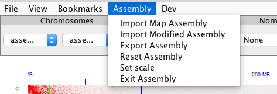
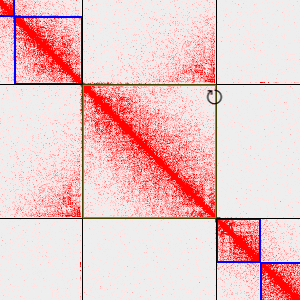
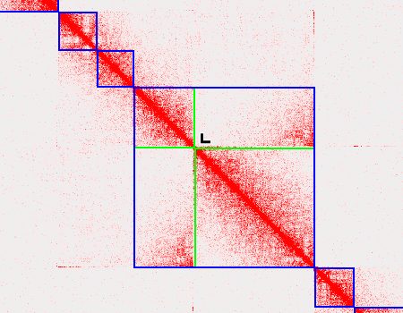

# Assembly Menu Options

 

## Loading and Saving Assemblies
Prerequisites: Load Maps, Generate Hic and .assembly file from 3D DNA Pipeline, Juicebox version 1.8.8

To load assemblies in Juiebox first load a Hic file then select "Import Map Assembly". Select an assembly file coresponding to the map loaded (.assembly)

To save the assembly changes made click "Export Assembly" this will create a .assembly file that can be used in the 3D DNA pipeline or can be used to save the session.

## Loading Previous Work

Load Original Map and .assembly file. Click on "Import Modified Assembly" and
Select previously saved work.

## Misc

"Reset Assembly" will reset the assembly to its original state
"Set scale" is used for changing the scaling of the Hic map. (comment on scaling possible)
"Exit Assembly" will exit the assembly mode in Juicebox

# Assembly Changes

## Selection

To select single features shift click on the feature. Shift click and drag to select Multiple features in a selection. Adjust the selction by click dragging at the edge of the selection

## Translate

Select one or more features then point and click mouse cursor near diagonal at intersection between features

## Invert

 

Select one or more features
Move cursor to upper right/ lower left corner of selection box and click

## Group/Ungroup

 

 Select in between fatures at the diagonal to toggle grouping of the feature

## Edit
Select a single feature and move mouse close to the diagonal unitl a yellow box appears. Resize the box using scroll and click to excute the edit

## Misc.
Undo cmd+u or ctrl+u redo cmd+r or ctrl+u
Jump to diagonal

