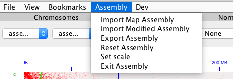

# Assembly Menu Options

 

## Loading and Saving Assemblies
Prerequisites: Load Maps, Generate Hic and .assembly file from 3D DNA Pipeline, Juicebox version 1.8.8

To load assemblies in Juiebox first load a Hic file then select "Import Map Assembly". Select an assembly file coresponding to the map loaded (.assembly)

To save the assembly changes made click "Export Assembly" this will create a .assembly file that can be used with a script to implemnt the changes in the orginal fasta file and can also be used to save the session. These changes can be used in the 3D DNA pipeline.

## Loading Previous Work

Load Original Map and .assembly file. Click on "Import Modified Assembly" and
Select previously saved work

## Other

"Reset Assembly" will reset the assembly to its original state
"Set scale" is used for changing the scaling of the Hic map. (comment on scaling possible)
"Exit Assembly" will exit the assembly mode in Juicebox

# Assembly Changes

## Selecting genomic interval

To select an interval consting of one scaffold shift click on a scaffold. Shift click and drag to select an interval of more than one scaffold. Adjust the selction by clicking and dragging at the edge of the selection

## Translocate

Select one or more scaffolds then point and click mouse cursor near diagonal at intersection between scaffolds

## Invert

 

Select one or more scaffolds
Move cursor to upper right/lower left corner of selection box and click

## Adjusting boundaries of superscaffold

 

Select in between scaffolds at the diagonal to adjust the boundary of a superscaffold

## correcting a misjoin
Select a single scaffold and move the mouse cursor close to the diagonal unitl a yellow box appears. Resize the box using scroll. Then, click to split the scaffold into three smaller scafolds. A short scaffold is formed inside the yellow box which is relocated to the end of the refrence genome assembly. The other two scaffold stay in place and can be moved independantly

## Right Click Menu

changes can be reversed or redone by selecting undo or redo or using the keyboard shortcut:
undo 'cmd+u' or 'ctrl+u' 
redo 'cmd+r' or  'ctrl+u'

Jump to diagonal moves the view to the diagonal in the direction of the arrow

