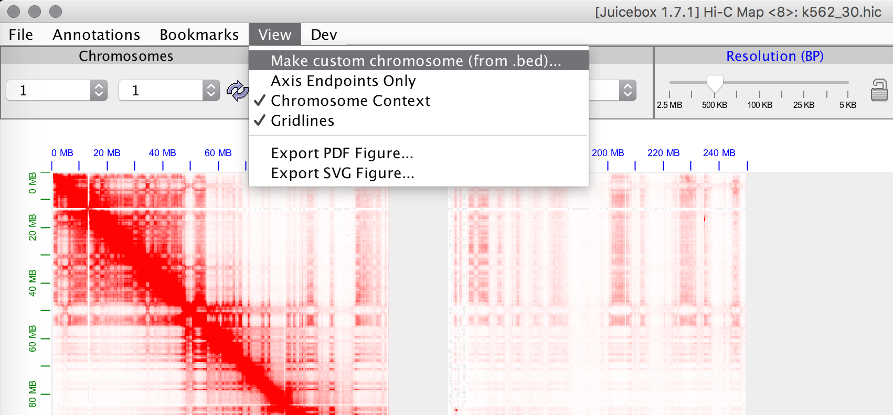
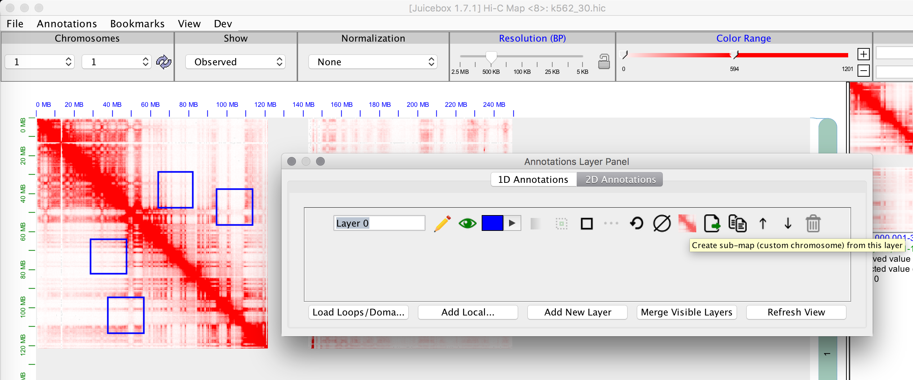
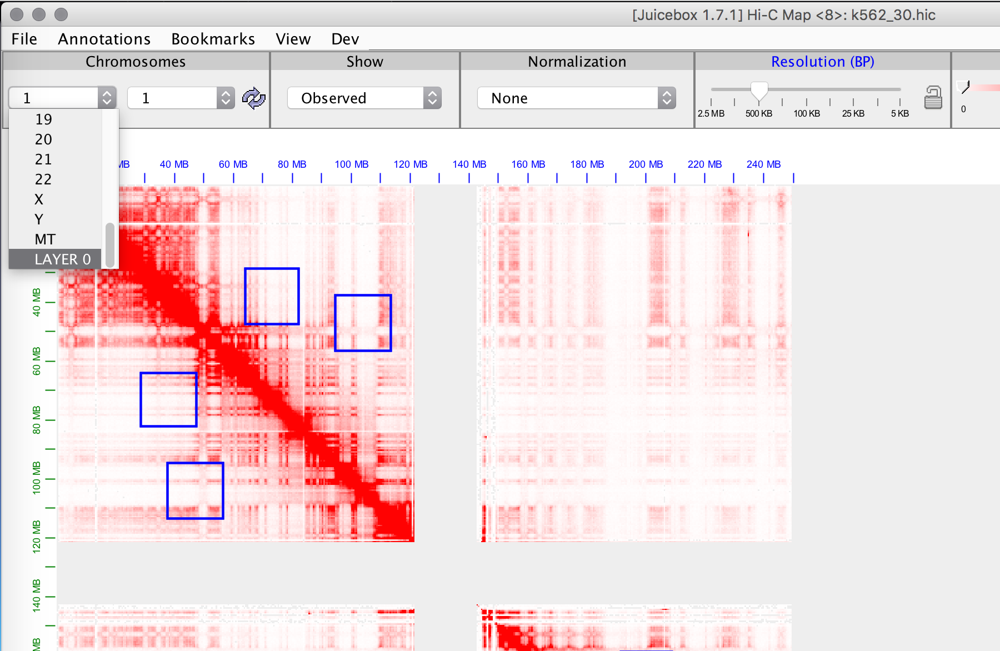
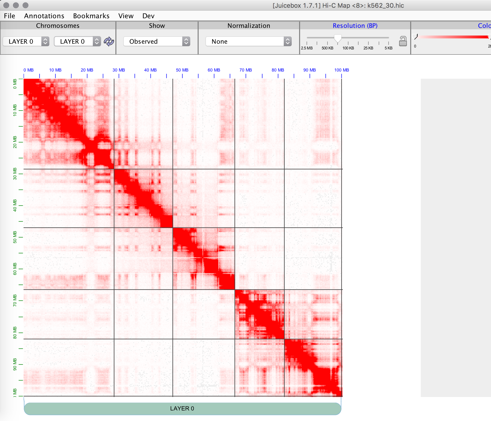
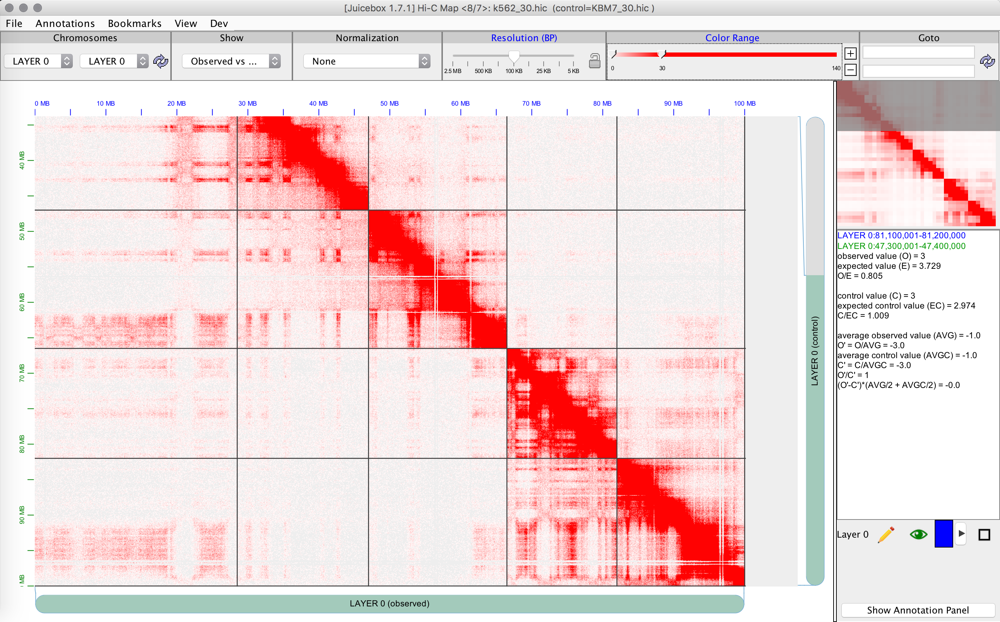
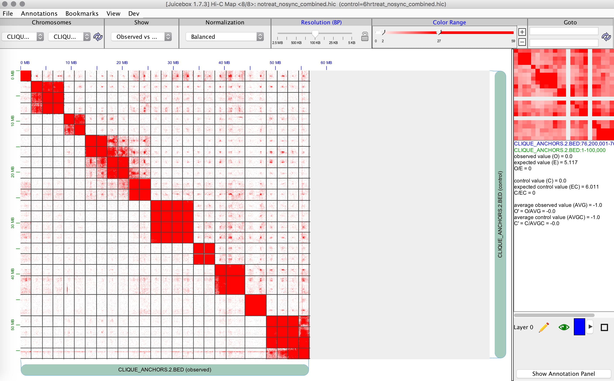

Submapping is memory intensive and makes several calls to the hic file, so it is recommended to only use this with local/downloaded files. The idea is to create a map with just the regions you are interested in (including different chromosomes; e.g. degron superenhancer clique). All the critical features should be working in this mode (zooming, VS mode, normalization, color scale, most 1D tracks, etc.), but if you encounter any bugs, please let us know. There are a few things missing (e.g. observed / expected is not yet available in this mode; observed over control is available though).

You can specify regions with either a bed file or with 2D annotations:

This will then create a new chromosome in the dropdown:

And it'll populate just the selected regions (with zooming/normalization preserved):

Here's an example of K562 vs KBM7 (lower right corner for differences):

Here's the degron superenhancer clique:

Gridlines can be toggled from the view menu.
